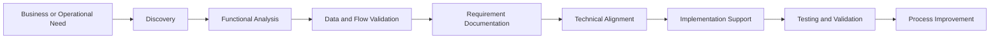

<div align="center">

[](https://git.io/typing-svg)

<a href="https://manuelkrivoy.vercel.app/">
  
</a>
<a href="https://www.linkedin.com/in/manuel-krivoy/">
  
</a>
<a href="mailto:krivoymanuel@gmail.com">
  
</a>
<a href="https://github.com/manuelKrivoy">
  
</a>

</div>

---

## 🧩 About Me

```javascript
const manuel = {
  role: "Functional Analyst",
  education: "Bachelor's Degree in Information Technology",
  location: "Rosario, Argentina 🇦🇷",
  industry: "Telemedicine",
  experience: [
    "Requirements analysis",
    "Production incident investigation",
    "REST API and integration analysis",
    "SQL and data validation",
    "Process documentation and improvement",
    "Technical and business communication"
  ],
  technicalBackground: [
    "Backend development",
    "Relational and NoSQL databases",
    "Web applications",
    "Local LLMs and task automation"
  ],
  mindset: "Understand the problem, connect the teams and improve the solution 🚀"
};
```

I’m an **IT graduate and Functional Analyst with a strong technical background**, currently working in the telemedicine industry.

I participate in the full analysis cycle: understanding requirements, investigating incidents, validating business flows, analyzing APIs and databases, documenting findings, and coordinating with technical and operational teams.

My previous and ongoing experience in **L2 IT Support** gives me a practical understanding of production environments and helps me transform real operational problems into clear functional improvements.

- 🔎 Requirements gathering and functional analysis
- 🔌 REST APIs, JSON payloads, authentication flows and integrations
- 🗄️ SQL queries, data validation and database analysis
- 🧪 Logs, incident investigation and root-cause analysis
- 📝 Process documentation and continuous improvement
- 🤝 Communication between business, operations, support and development teams
- 🤖 Local LLM integration and technical task automation

---

## 🔄 From Need to Solution



<div align="center">

### `Business ↔ Functional Analysis ↔ Technology`

</div>

---

## 🎯 Functional Analysis

<table>
  <tr>
    <td width="50%" valign="top">
      <h3>📋 Requirements & Processes</h3>
      <ul>
        <li>Requirement gathering and analysis</li>
        <li>Business flow validation</li>
        <li>Functional documentation</li>
        <li>Process definition and improvement</li>
        <li>Scope and impact analysis</li>
      </ul>
    </td>
    <td width="50%" valign="top">
      <h3>🔌 APIs & Integrations</h3>
      <ul>
        <li>REST endpoint analysis</li>
        <li>JSON payload and response validation</li>
        <li>JWT and authentication flow analysis</li>
        <li>External system integration troubleshooting</li>
        <li>Technical-functional flow validation</li>
      </ul>
    </td>
  </tr>
  <tr>
    <td width="50%" valign="top">
      <h3>🧪 Incidents & Data</h3>
      <ul>
        <li>Production incident investigation</li>
        <li>Log analysis and evidence gathering</li>
        <li>PostgreSQL and MySQL queries</li>
        <li>Data consistency validation</li>
        <li>Root-cause analysis</li>
      </ul>
    </td>
    <td width="50%" valign="top">
      <h3>🤝 Collaboration</h3>
      <ul>
        <li>Coordination with development and product teams</li>
        <li>Communication with technical and operational areas</li>
        <li>Internal and external stakeholder support</li>
        <li>Scrum and Kanban environments</li>
        <li>Follow-up and documentation of findings</li>
      </ul>
    </td>
  </tr>
</table>

---

## 💼 Professional Experience

<table>
  <tr>
    <td width="85">🧩</td>
    <td>
      <strong>Doc24 — Functional Analyst</strong><br/>
      <sub>Telemedicine · June 2026 — Present</sub><br/><br/>
      Requirements gathering and functional analysis, incident investigation, REST API integration analysis, business-flow validation, SQL queries, process documentation, and coordination with technical and operational teams.
    </td>
  </tr>
  <tr>
    <td width="85">🛠️</td>
    <td>
      <strong>Doc24 — L2 IT Support</strong><br/>
      <sub>Telemedicine · May 2024 — Present</sub><br/><br/>
      Second-level support for a telemedicine platform, including complex incident resolution, log and PostgreSQL analysis, external integration diagnosis, operational reporting, documentation, and collaboration with development and product teams.
    </td>
  </tr>
  <tr>
    <td width="85">🧪</td>
    <td>
      <strong>Doc24 — PCR Logistics Coordinator</strong><br/>
      <sub>2020 — 2021</sub><br/><br/>
      Coordination of medical support operations, task organization, and communication between work teams for PCR testing logistics.
    </td>
  </tr>
  <tr>
    <td width="85">🗂️</td>
    <td>
      <strong>Sanatorio GO — Data Entry | Philips Tasy</strong><br/>
      <sub>January 2021 — July 2021</sub><br/><br/>
      Data loading and validation, operational support, and assistance during the migration and implementation of a hospital information system.
    </td>
  </tr>
</table>

---

## 🧰 Tools & Technologies

### Functional Analysis, Data & Management

<p align="left">
  
  
  
  
  
  
  
  
  
  
  
  
</p>

### Software Development

<p align="left">
  
</p>

### AI & Automation

<p align="left">
  
  
  
  
</p>

> My development and support background helps me understand system behavior, assess technical feasibility, and communicate effectively with engineering teams.

---

## 🎓 Education & Certifications

<table>
  <tr>
    <td>🎓</td>
    <td><strong>Bachelor’s Degree in Information Technology</strong><br/>Universidad de Palermo · 2021 — 2026</td>
  </tr>
  <tr>
    <td>💻</td>
    <td><strong>Technical Degree in Professional and Personal Informatics</strong><br/>Instituto Politécnico Superior, UNR · 2015 — 2020</td>
  </tr>
  <tr>
    <td>⚛️</td>
    <td><strong>React JS Certification</strong> — Coderhouse</td>
  </tr>
  <tr>
    <td>☕</td>
    <td><strong>Spring Boot Certification</strong> — Coderhouse</td>
  </tr>
  <tr>
    <td>🌐</td>
    <td><strong>Fullstack Certification</strong> — ITBA</td>
  </tr>
</table>

**Languages:** Spanish — Native · English — Intermediate

---

## 💡 What I Bring to a Team

```text
✔ Functional and technical perspective
✔ Requirements and business-flow analysis
✔ SQL, APIs, integrations and troubleshooting
✔ Production incident and root-cause analysis
✔ Clear documentation and communication
✔ Coordination between business and technical teams
✔ Organization, ownership and continuous learning
```

---

## 🚀 Development Background

My projects complement my functional profile by giving me hands-on experience with frontend, backend, APIs, databases, authentication, and application architecture.

<table>
  <tr>
    <td width="50%" valign="top">
      <h3>🏦 ITBANK Homebanking</h3>
      Fullstack homebanking application with transfers, payments, and account queries.
      <br/><br/>
      <code>Next.js</code> <code>Django</code> <code>MySQL</code>
    </td>
    <td width="50%" valign="top">
      <h3>📱 ClockApp</h3>
      Mobile application for saving and sharing time records using geolocation.
      <br/><br/>
      <code>React Native</code> <code>Firebase</code>
    </td>
  </tr>
  <tr>
    <td width="50%" valign="top">
      <h3>🔳 QR Generator</h3>
      Interactive web application for generating custom QR codes.
      <br/><br/>
      <code>React</code> <code>qrcode.react</code>
    </td>
    <td width="50%" valign="top">
      <h3>✅ Fullstack Task Page</h3>
      Notes and task application with an API and user administration panel.
      <br/><br/>
      <code>React</code> <code>Express</code> <code>MySQL</code>
    </td>
  </tr>
</table>

<div align="center">

<a href="https://manuelkrivoy.vercel.app/">
  
</a>

</div>

---

## 💬 Let’s Connect

I’m interested in opportunities where I can combine **functional analysis, technical knowledge, data, communication, and problem solving** to improve digital products and processes.

<div align="center">

### 📫 `krivoymanuel@gmail.com`

**Thanks for visiting my profile!** ⭐

</div>


